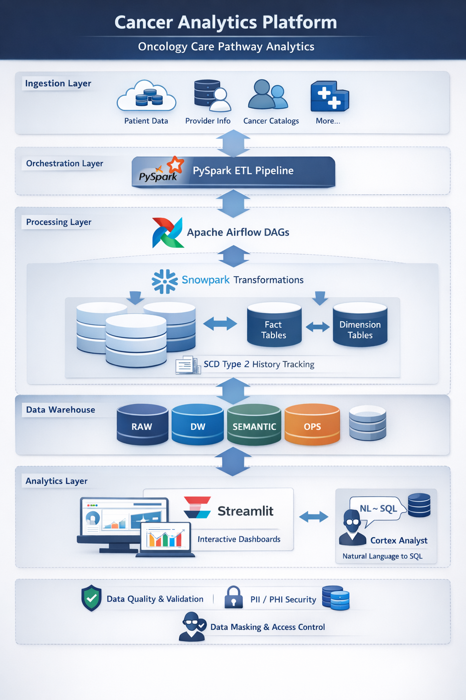
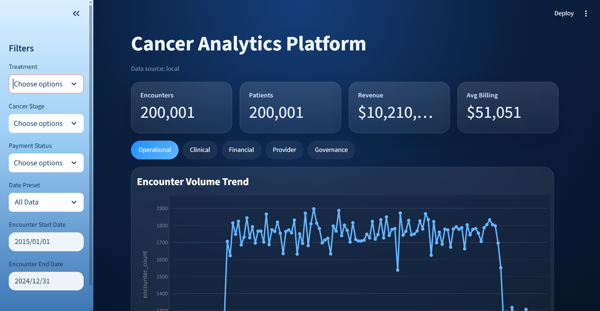
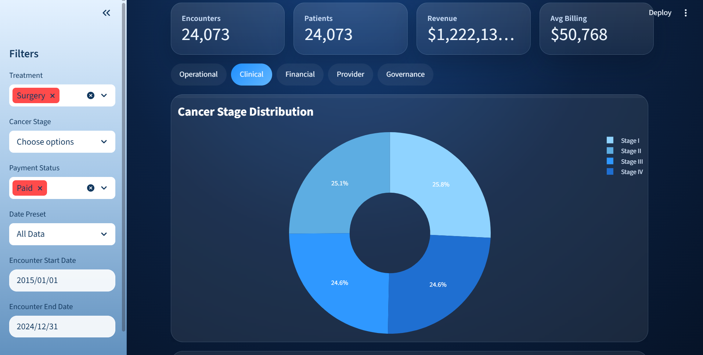
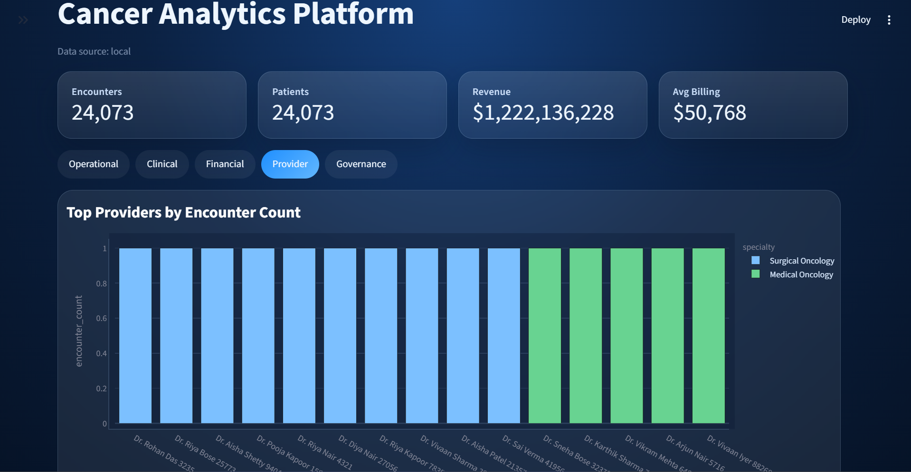
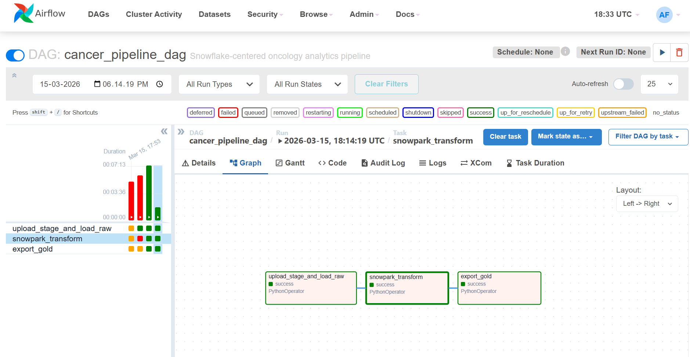
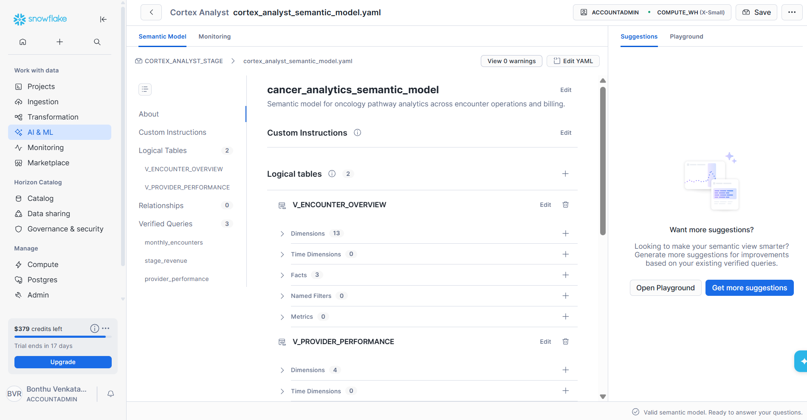

# Cancer Analytics Platform – Oncology Care Pathway Analytics

## Overview

The Cancer Analytics Platform is a cloud-based data engineering and analytics solution designed to provide operational and financial insights across the oncology care lifecycle. It processes healthcare datasets such as patients, providers, cancer catalog records, treatment encounters, and billing into a structured Snowflake data warehouse for reporting and analytics.

## Key Features

- End-to-end pipeline using **PySpark**, **Snowflake internal stage**, **Snowpark**, and **Apache Airflow**
- **Snowflake data warehouse** with star-schema style fact and dimension modeling
- **SCD Type 2** implementation for patient and cancer catalog history tracking
- **Streamlit dashboards** for operational, clinical, financial, provider, and governance analytics
- Natural language querying through **Cortex Analyst**
- Data quality checks, reject handling structure, and audit logging
- Governance controls through masking policies and role-based access control

## Architecture

### Layers

1. **Ingestion Layer**
   - Source CSV data is stored in `data/raw`
   - PySpark jobs support local medallion-style preprocessing
   - Source files are uploaded into a Snowflake internal stage for warehouse ingestion

2. **Orchestration Layer**
   - Apache Airflow schedules and manages ETL workflows using DAGs
   - Airflow coordinates Snowflake RAW loading, Snowpark transforms, and gold export

3. **Processing Layer**
   - Snowpark and SQL transformations build the warehouse model
   - Fact and dimension tables are populated in Snowflake
   - SCD Type 2 logic is applied to tracked dimensions

4. **Data Warehouse Layer**
   - Snowflake schemas:
     - `RAW`
     - `DW`
     - `SEMANTIC`
     - `OPS`

5. **Analytics Layer**
   - Streamlit dashboards provide interactive reporting
   - Cortex Analyst enables NL-to-SQL against the semantic layer

## Tech Stack

- PySpark
- Apache Airflow
- Snowflake
- Snowpark
- SQL
- Streamlit
- Plotly
- Cortex Analyst

## Project Structure

```text
cancer-analytics-project/
|
├── airflow/                # Airflow config, DAGs, Docker Compose
├── dashboards/             # Streamlit app and dashboard data access
├── data/
│   └── raw/                # Raw CSV datasets
├── docs/
│   └── images/             # README screenshots
├── pyspark_jobs/           # Local PySpark ETL scripts
├── snowflake/              # Warehouse setup, SQL, Snowpark transform, semantic model
├── utils/                  # Snowflake load/export utilities
├── requirements.txt
└── README.md
```

## Setup Instructions

### 1. Clone Repository

```powershell
git clone https://github.com/BNVR/Cancer-Analytics-Platform-Oncology-Care-Pathway-Analytics.git
cd Cancer-Analytics-Platform-Oncology-Care-Pathway-Analytics
```

### 2. Create and Activate Virtual Environment

```powershell
python -m venv airflow_venv
.\airflow_venv\Scripts\Activate.ps1
python -m pip install --upgrade pip
pip install -r requirements.txt
```

### 3. Configure Snowflake Environment Variables

```powershell
$env:SNOWFLAKE_ACCOUNT="BGCFXOC-KZ47840"
$env:SNOWFLAKE_USER="BNVRAMANA"
$env:SNOWFLAKE_PASSWORD="<your_password>"
$env:SNOWFLAKE_WAREHOUSE="CANCER_ANALYTICS_WH"
$env:SNOWFLAKE_DATABASE="CANCER_ANALYTICS_DB"
$env:SNOWFLAKE_SCHEMA="RAW"
$env:SNOWFLAKE_ROLE="ACCOUNTADMIN"
$env:CAP_STORAGE_MODE="local"
```

### 4. Create Snowflake Warehouse Objects

Run:

```sql
-- run snowflake/project_2.sql
```

### 5. Load RAW Data into Snowflake

```powershell
python utils/load_stage_to_snowflake.py
```

### 6. Run Transformations

Using Snowpark:

```powershell
python snowflake/snowpark_transform.py
```

Or using SQL:

```sql
-- run snowflake/load_dw_from_raw.sql
```

### 7. Export Gold Layer

```powershell
python utils/export_gold_from_snowflake.py
```

### 8. Run Streamlit Dashboard

```powershell
streamlit run dashboards/app.py
```

### 9. Run Airflow

```powershell
cd airflow
docker compose up -d
```

Access Airflow UI:

```text
http://127.0.0.1:8080
```

Username: `admin`  
Password: `admin`

## Data Model

### Core Warehouse Tables

- `DW.DIM_PATIENTS`
- `DW.DIM_CANCER_CATALOG`
- `DW.DIM_PROVIDERS`
- `DW.DIM_DATE`
- `DW.FACT_ENCOUNTERS`
- `DW.BRIDGE_ENCOUNTER_PROVIDER`

### Semantic Views

- `SEMANTIC.V_ENCOUNTER_OVERVIEW`
- `SEMANTIC.V_FINANCIAL_ANALYTICS`
- `SEMANTIC.V_PROVIDER_PERFORMANCE`

## Data Governance

- Data masking for patient identifiers and names
- Role-Based Access Control (RBAC)
- Audit logging in `OPS.PIPELINE_AUDIT`
- Reject tracking structure in `OPS.REJECTED_RECORDS`
- Data validation checks in pipeline outputs

## Use Cases

- Monitor oncology encounter trends
- Analyze treatment mix and treatment response
- Track billing and financial performance
- Study cancer stage distribution
- Review provider encounter and response metrics
- Explore semantic queries through Cortex Analyst

## Screenshots

### Project Architecture



### Dashboard Overview



### Clinical Overview



### Provider Analytics



### Airflow DAG Success



### Cortex Analyst Query



## Notes

- This project does not require AWS.
- Snowflake internal stage acts as the cloud storage landing layer for source CSV extracts.
- Provider performance is modeled through deterministic encounter-to-provider assignment because the source encounter data does not include native `provider_id`.
- Cortex Analyst is configured through `snowflake/cortex_analyst_semantic_model.yaml`.

## Author

**Bonthu Naga Venkata Ramana**  
Aspiring Data Engineer | Snowflake | PySpark | Airflow | Streamlit

## Project Highlights

- Real-world healthcare analytics use case
- End-to-end pipeline from ingestion to analytics
- Snowflake-centered cloud analytics architecture
- Live Airflow orchestration and Cortex Analyst demonstration
